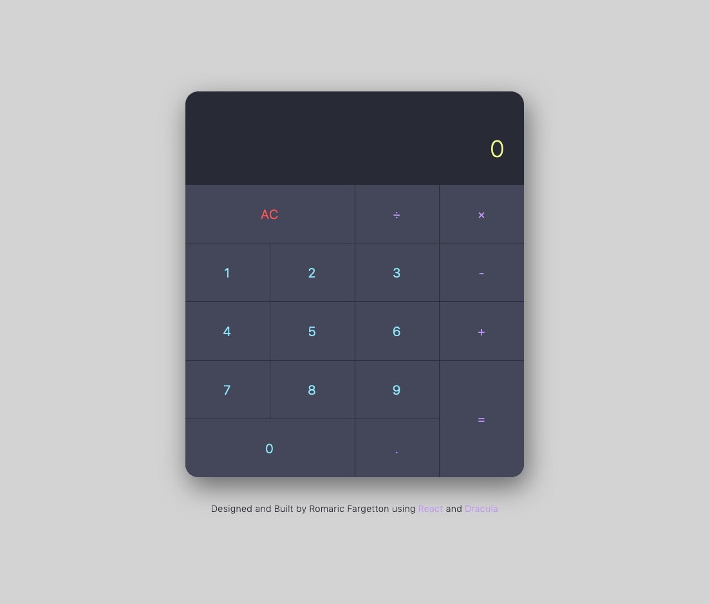

# React Calculator

A simple calculator built using React, create-react-app and Dracula color scheme. See a live demo [here](https://hardcore-shirley-335447.netlify.com).

[](https://app.netlify.com/sites/hardcore-shirley-335447/deploys)



## Installation

1. Clone this repo
    ```
    git clone https://www.github.com/rfargetton/react-calculator
    ``` 
2. Install npm packages
    ```
    cd react-drum-machine && npm install
    ```
3. Run a development server
    ```
    npm start
    ```
4. Create a production build
    ```
    npm run build
    ```

